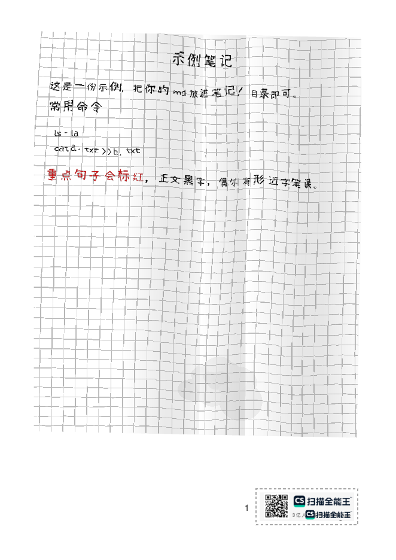
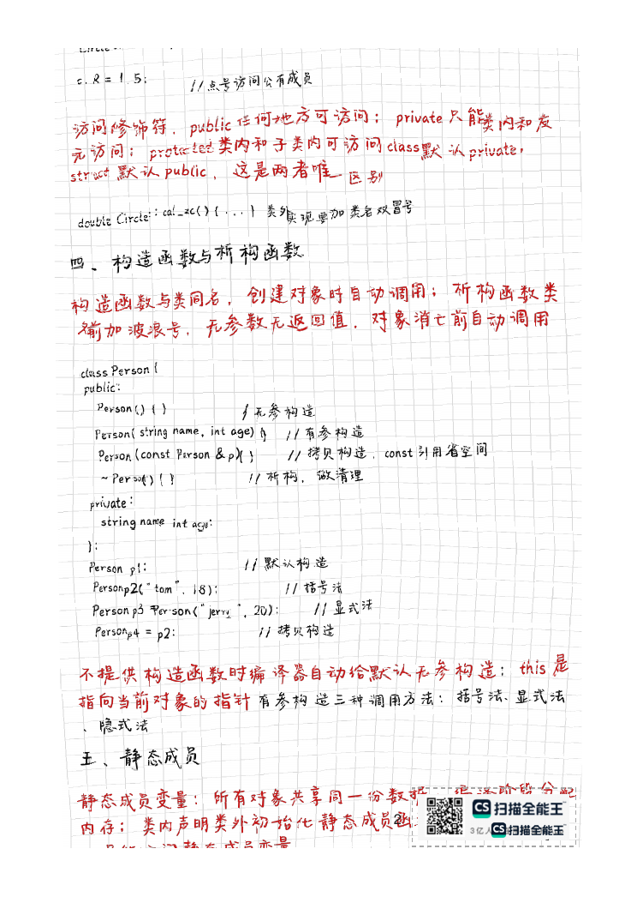

# Handwrite Notes 手写笔记生成

把 Markdown 笔记渲染成"拍照扫描的手写笔记本"风格 PDF。

 




## 特性

- **大字手写体**：逐字渲染，整字随机仿射（大小/旋转/双向剪切/随机锚点）
- **字的局部仿射**：每个字随机选 1/4 区域做强仿射（缩放 0.65~1.4、旋转 ±12°、平移），羽化无接缝
- **字随纸弯**：网格与字形共用同一个低频弯曲场，纸面弯到哪里字就跟到哪里
- **扫描质感**：竖向阴影带、喷漆溅点（每页 1~2 簇）、污渍团与咖啡圈渍（全部位于网格与文字下层，绝不遮挡）
- **红笔重点**：md 里 `**加粗**` 即标红，放大不加粗
- **真人笔误**：小概率形近字错别字（30+ 对映射表，可自定义）；命令与代码永不出错
- **扫描盖印**：右下角水印（虚线框包围）+ 正常字体页码，逐页盖印
- **全参数配置化**：所有效果集中在 config.yaml

## 快速开始

```bash
bash install.sh          # 一键安装依赖（wkhtmltopdf 需 sudo apt install wkhtmltopdf）
cp 我的笔记.md 笔记/
bash 一键生成.sh          # 输出在 手写版/
```

手动运行：

```bash
python3 md2handwrite.py 笔记/xxx.md            # 单文件
python3 md2handwrite.py 笔记/                  # 整个目录
python3 md2handwrite.py xxx.md -c my.yaml -o out
```

## 依赖

- 系统：wkhtmltopdf（`sudo apt install wkhtmltopdf`）
- Python：pypdf、reportlab、pillow、pyyaml（install.sh 会自动装）
- 字体：fonts/ 下的手写 TTF（可换成任意手写字体，改 config.yaml 的 font.path）

## 命令行参数

```
python3 md2handwrite.py [md文件或目录] [-o 输出目录] [-c 配置文件]
        --seed-salt 文本    换一批笔误/弯曲/溅点（同一文件不同 salt 结果不同）
        --no-stamp          跳过水印与页码盖印
```

## 参数调优指南

config.yaml 常用参数速查（改完保存，重跑即可生效）：

| 想要的效果 | 改哪里 |
|---|---|
| 字更大 / 更小 | font.em（正文字号）；font.heading_px 各级标题 |
| 行更密 / 更疏 | font.line_height（1.2 为紧凑笔记风） |
| 字更"飘" / 更"稳" | glyph.jitter.size 与 rotate_deg 范围调大 / 调小 |
| 字的局部变形更狠 | glyph.quarter_affine.scale 偏离 1 越远越狠 |
| 墨色更深 / 更浅 | ink.black 调深；ink.alpha_jitter 上限调低 |
| 纸更皱 / 更平 | paper.field.amp（建议 8~20） |
| 折痕更深 / 更浅 | paper.dent.depth（3~8 为自然范围） |
| 阴影带多少 | paper.bands.count（[0,2] = 每页 0~2 条） |
| 阴影深浅 | paper.bands.gray（越接近 255 越淡） |
| 纸更脏 | paper.noise.grain_enabled: true + gauss_sigma 调大 |
| 污渍多少 | paper.noise.stains.count |
| 错别字频率 | typos.rate（0.008 ≈ 每页 1~5 个） |
| 不要错别字 | typos.enabled: false |
| 换一批笔误 / 弯曲 / 溅点 | 命令行 --seed-salt 随便输个文本 |
| 不要水印页码 | --no-stamp 或 config.yaml 的 watermark 留空 |

## FAQ

- **有缺字 / 方块？** 字体缺字会回退到霞鹜文楷栈；换覆盖更全的字体或更新 font.path
- **重新生成结果一模一样？** 同一文件名 + 相同 config 的结果是固定的；想变化加 `--seed-salt`
- **笔误出现在命令里了？** 不会——代码块自动排除笔误
- **首次生成很慢？** 正在构建字形图片缓存（assets/chars/），之后同字符直接复用；删除该目录可强制重绘
- **背景太脏 / 太干净？** 三个旋钮：noise.grain_enabled、noise.stains.count、bands.count
- **页码能换字体吗？** page_number_font 任意 fontconfig 字体（默认 Helvetica，刻意不用手写体）

## 作为 Agent Skill 使用

本目录符合 Agent Skill 规范（SKILL.md + 资源）。把 `handwrite-notes/`
整个文件夹放进 `~/.zcode/skills/`（或对应 Agent 的 skills 目录），
Agent 即可在用户要求"生成手写笔记 PDF"时自动调用。

## 目录结构

```
handwrite-notes/
├── SKILL.md            # Skill 描述与使用说明
├── README.md
├── config.yaml         # 全部渲染参数
├── md2handwrite.py     # 渲染主脚本
├── install.sh          # 一键安装依赖
├── 一键生成.sh          # 手动一键启动
├── fonts/              # 手写字体
├── assets/             # 水印、字形缓存、网格与噪点贴图
└── 笔记/               # 放入待转换的 .md
```

## 许可

代码以 **MIT 协议**开源。**默认字体为小赖字体 SC（XiaolaiSC，SIL OFL 开源协议）**，可随包分发；
如替换为 fonts.net.cn 等来源的商业/免费字体，其许可以来源页说明为准，且此类字体文件已在 .gitignore 中排除、请勿提交到 git。
