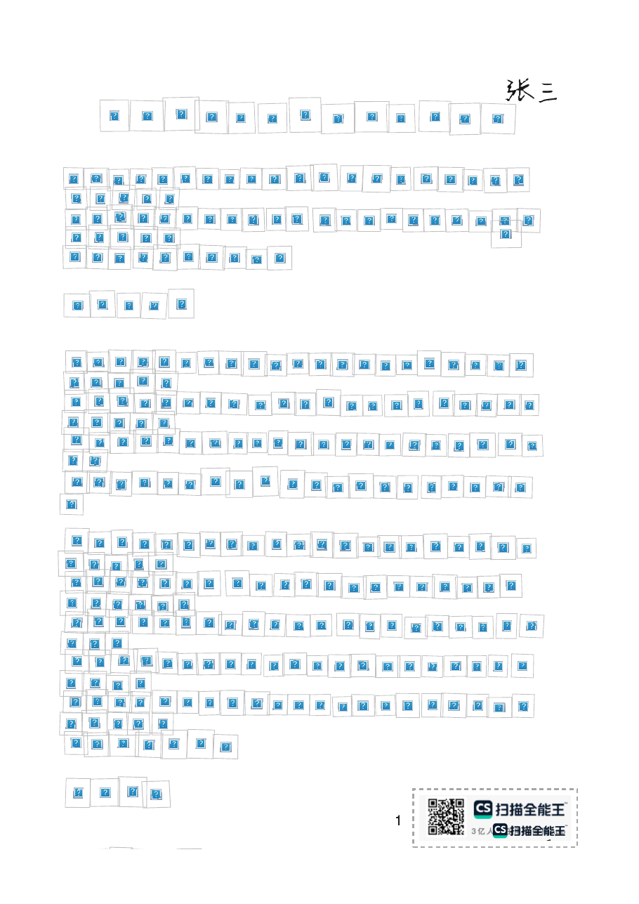
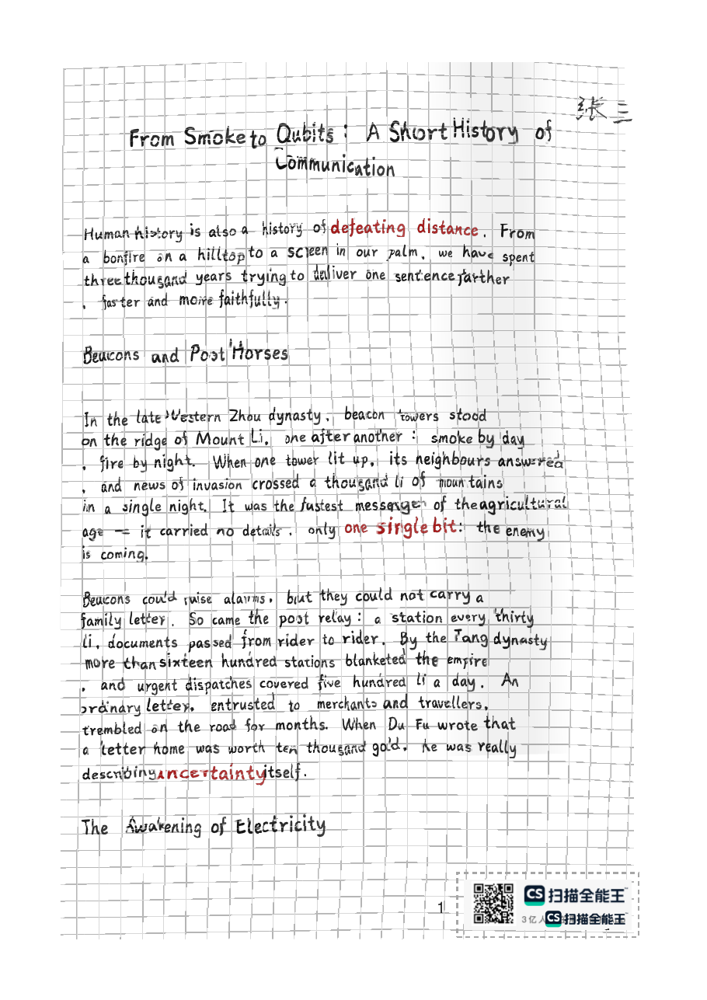
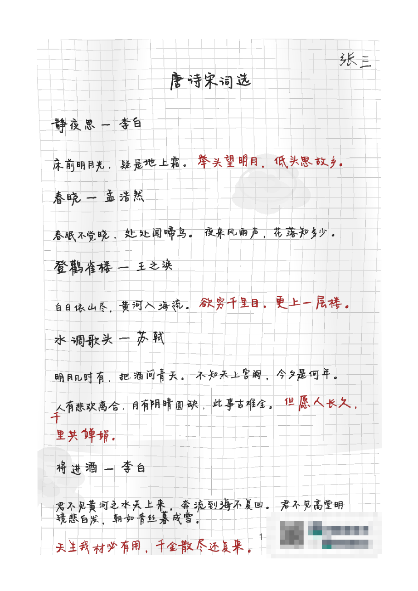
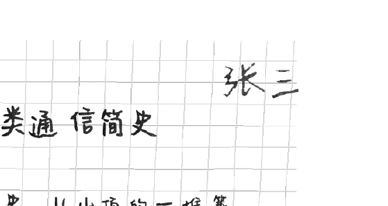
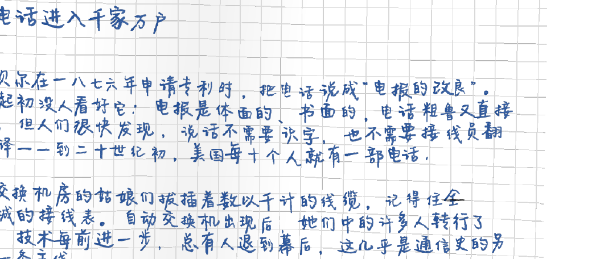
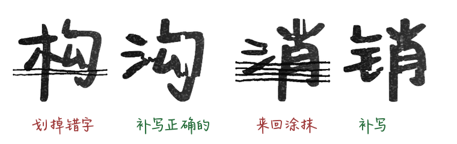
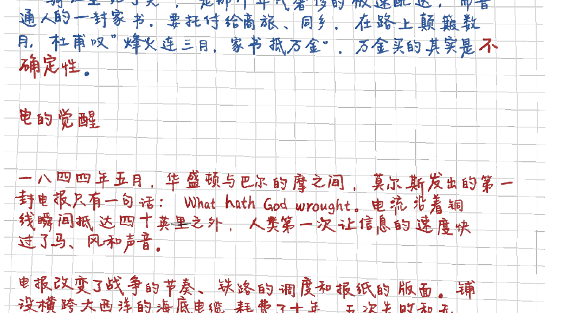
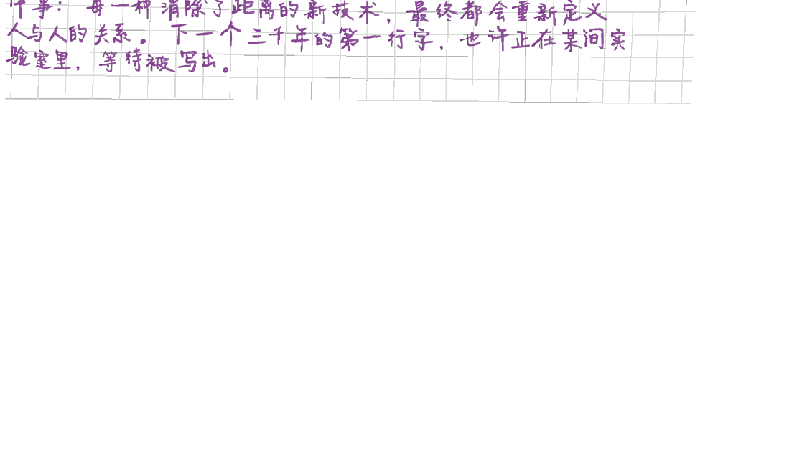
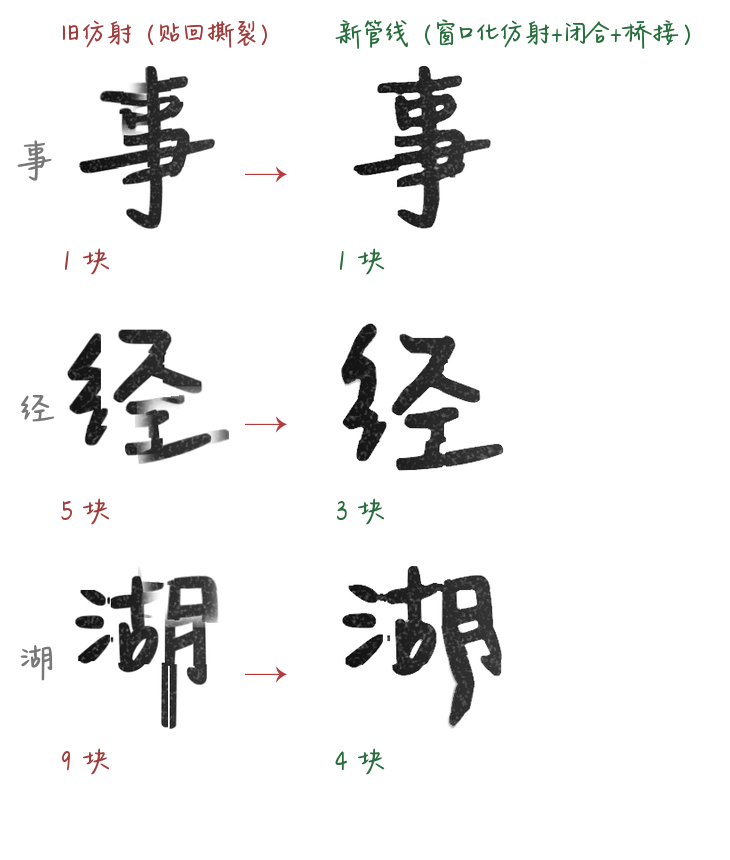

# Handwrite Notes 手写笔记生成

把 Markdown 笔记渲染成"拍照扫描的手写笔记本"风格 PDF。

 

| 彩色多笔 | 英文 | 古诗词 |
|---|---|---|
|  |  |  |

## 特性

- **大字手写体**：逐字渲染，整字随机仿射（大小/旋转/双向剪切/随机锚点）
- **字的局部仿射**：每个字随机选 1/4 区域做强仿射（缩放 0.65~1.4、旋转 ±12°、平移），羽化无接缝
- **字随纸弯**：网格与字形共用同一个低频弯曲场，纸面弯到哪里字就跟到哪里
- **扫描质感**：竖向阴影带、喷漆溅点（每页 1~2 簇）、污渍团与咖啡圈渍（全部位于网格与文字下层，绝不遮挡）
- **红笔重点**：md 里 `**加粗**` 即标红，放大不加粗
- **真人笔误**：小概率形近字错别字（30+ 对映射表，可自定义）；命令与代码永不出错
- **扫描盖印**：右下角水印（虚线框包围）+ 正常字体页码，逐页盖印
- **全参数配置化**：所有效果集中在 config.yaml
- **手写签名**：当前手写字体渲染，指定页右上角随机大小/位置/角度（`--sign` 开启）
- **手写涂改**：错别字部分被划掉/涂抹并在后面补写正确的字
- **连通修复**：仿射造成的笔画断裂自动桥接焊回

### 特性演示

手写签名（占位"张三"，config 改成自己的名字）：



多色墨迹轮换（每遇章节换一支笔，`ink.pen_palette` 可选）：



手写涂改（`typos.crossout.*`）：



红笔重点（`**加粗**` 标红放大不加粗）：



弯曲网格 + 竖向阴影带 + 溅点污渍（全部在文字下层）：



扫描水印 + 印刷体页码（水印素材不入库，示例已打码）：


### 字形管线效果（抗断裂）

仿射贴回撕裂 vs 新管线（窗口化仿射 + cv2 闭合 + 轮廓桥接）：



## 快速开始

```bash
bash install.sh          # 一键安装依赖（交互确认；--yes 跳过询问）

cp 我的笔记.md 笔记/
bash generate.sh          # 输出在 手写版/
```

手动运行：

```bash
python3 md2handwrite.py 笔记/xxx.md            # 单文件
python3 md2handwrite.py 笔记/                  # 整个目录
python3 md2handwrite.py xxx.md -c my.yaml -o out
```

## 依赖

- 系统：wkhtmltopdf（`sudo apt install wkhtmltopdf`）
- Python：pypdf、reportlab、pillow、pyyaml、markdown（install.sh 会确认后安装；创建新 conda 环境或换解释器前会先询问）
- 字体：fonts/ 下的手写 TTF（可换成任意手写字体，改 config.yaml 的 font.path）

## 命令行参数

```
python3 md2handwrite.py [md文件或目录] [-o 输出目录] [-c 配置文件]
        --seed-salt 文本    换一批笔误/弯曲/溅点（同一文件不同 salt 结果不同）
        --no-stamp          跳过水印与页码盖印
```

## 参数调优指南

config.yaml 常用参数速查（改完保存，重跑即可生效）：

| 想要的效果 | 改哪里 |
|---|---|
| 字更大 / 更小 | font.em（正文字号）；font.heading_px 各级标题 |
| 行更密 / 更疏 | font.line_height（1.2 为紧凑笔记风） |
| 字更"飘" / 更"稳" | glyph.jitter.size 与 rotate_deg 范围调大 / 调小 |
| 字的局部变形更狠 | glyph.quarter_affine.scale 偏离 1 越远越狠 |
| 墨色更深 / 更浅 | ink.black 调深；ink.alpha_jitter 上限调低 |
| 纸更皱 / 更平 | paper.field.amp（建议 8~20） |
| 折痕更深 / 更浅 | paper.dent.depth（3~8 为自然范围） |
| 阴影带多少 | paper.bands.count（[0,2] = 每页 0~2 条） |
| 阴影深浅 | paper.bands.gray（越接近 255 越淡） |
| 纸更脏 | paper.noise.grain_enabled: true + gauss_sigma 调大 |
| 污渍多少 | paper.noise.stains.count |
| 错别字频率 | typos.rate（0.008 ≈ 每页 1~5 个） |
| 不要错别字 | typos.enabled: false |
| 换一批笔误 / 弯曲 / 溅点 | 命令行 --seed-salt 随便输个文本 |
| 不要水印页码 | --no-stamp 或 config.yaml 的 watermark 留空 |

## FAQ

- **有缺字 / 方块？** 缺字会自动跳过并记录日志（不会出现问号方块）；换覆盖更全的字体可减少跳过
- **重新生成结果一模一样？** 同一文件名 + 相同 config 的结果是固定的；想变化加 `--seed-salt`
- **笔误出现在命令里了？** 不会——代码块自动排除笔误
- **首次生成很慢？** 正在构建字形图片缓存（assets/chars/），之后同字符直接复用；删除该目录可强制重绘
- **背景太脏 / 太干净？** 三个旋钮：noise.grain_enabled、noise.stains.count、bands.count
- **页码能换字体吗？** page_number_font 任意 fontconfig 字体（默认 Helvetica，刻意不用手写体）

## 自定义资源（字体 / 纸张 / 水印）

| 资源 | 位置 | 使用方法 |
|---|---|---|
| 手写字体 | `fonts/` | 放入任意 TTF，改 config.yaml 的 `font.path: fonts/你的字体.ttf` |
| 纸张照片背景 | `papers/` | 可选。config 的 `paper.background_image` 指向哪张，文字就写在哪张纸上；**留空（默认）= 程序合成的弯曲网格纸（推荐，效果见 examples/）**。注意：AI 纸张分辨率 1024×1536，整页拉伸会糊，适合短页或封面；实拍高清纸张照片则不受限 |
| 扫描水印 | `assets/cs_watermark.png` | 替换为你自己的水印图（右下角，虚线框自动包围）；config 的 `watermark` 留空则不盖印 |
| 错别字映射表 | config.yaml `typos.pairs` | 形近字/同音字对，按需增删 |

非开源字体（如商业手写体）放入项目后已被 .gitignore 排除，不会进入 git。

## 作为 Agent Skill 使用

本目录符合 Agent Skill 规范（SKILL.md + 资源）。把 `handwrite-notes/`
整个文件夹放进 `~/.zcode/skills/`（或对应 Agent 的 skills 目录），
Agent 即可在用户要求"生成手写笔记 PDF"时自动调用。

## 目录结构

```
handwrite-notes/
├── SKILL.md            # Skill 描述与使用说明
├── README.md
├── LICENSE             # MIT
├── config.yaml         # 全部渲染参数
├── md2handwrite.py     # 渲染主脚本
├── install.sh          # 一键安装依赖
├── generate.sh         # 一键生成（手动启动入口）
├── fonts/              # 手写字体（默认小赖 SC，OFL 可再分发；自己的字体放这里并改 config）
├── papers/             # 可选纸张照片背景（AI 生成）
├── assets/             # 水印、字形缓存、网格与噪点贴图
├── docs/               # 效果预览图
├── examples/           # 输出效果示例 PDF（真实管线产物）
└── 笔记/               # 放入待转换的 .md
```

## 许可

代码以 **MIT 协议**开源。**默认字体为开鑫九霄（个人手写风字体，随库分发）**，fonts/ 另有 5 款开源手写字体（协议见 fonts/README.md）；
如替换为 fonts.net.cn 等来源的商业/免费字体，其许可以来源页说明为准，且此类字体文件已在 .gitignore 中排除、请勿提交到 git。

## 一些话

ai时代，手写对于某些场景可能越来越重要，不仅仅是为了美观，更是为了防止被 AI 轻易识别和抄袭，或者为了某些要求和作业。希望这个工具能帮你把笔记变得更有"人味"。

## 免责声明

本工具仅供学习和研究使用，不保证生成结果的准确性、完整性或适用性。用户在使用本工具时应自行承担风险，开发者不对因使用本工具而产生的任何直接或间接损失承担责任。同时本工具仅仅为了在CV已经没啥前途的时代对传统CV技术的一点点留念，仅仅用于学术和学习，禁止用于进行欺诈。

## 开源资源与出处

本项目使用/依赖的第三方资源原始出处如下（感谢所有开源作者）：

### 字体（fonts/）

| 字体 | 作者 | 协议 | 原始出处 |
|---|---|---|---|
| 开心就笑淋雨就走（KXJXLYJZ，默认） | NIPPER (2019) | **来源与许可不详** | 经字体天下转载获得，未找到原始发布页 |
| 小赖字体 SC (Xiaolai SC) | 落霞孤鹜 (lxgw)，基于濑户字体 (瀬戸のぞみ) 改良 | SIL OFL 1.1 | [Google Fonts](https://fonts.google.com/specimen/Xiaolai+SC) · [猫啃网介绍](https://www.maoken.com) |
| 马善政 (Ma Shan Zheng) | 陈光马善政书法 | SIL OFL 1.1 | [Google Fonts](https://fonts.google.com/specimen/Ma+Shan+Zheng) |
| 龙藏体 (Long Cang) | 龙藏 | SIL OFL 1.1 | [Google Fonts](https://fonts.google.com/specimen/Long+Cang) |
| 志莽行书 (Zhi Mang Xing) | 志莽 | SIL OFL 1.1 | [Google Fonts](https://fonts.google.com/specimen/Zhi+Mang+Xing) |
| 霞鹜文楷 (LXGW WenKai) | 落霞孤鹜 (lxgw) | SIL OFL 1.1 | [GitHub](https://github.com/lxgw/LxgwWenKai) |

> **版权声明**：默认字体"开心就笑淋雨就走"为个人手写字体，经第三方字体站转载获得，
> 未找到其原始授权条款。本项目仅作技术演示分发；**若原作者认为分发行为侵犯其权益，
> 请提交 Issue 或联系仓库所有者，我们将第一时间删除该字体文件并更换默认字体。**
> 可放心商用的替代字体见上表（均为 SIL OFL 1.1，可自由再分发）。

### 依赖库与工具

| 项目 | 用途 | 协议 | 出处 |
|---|---|---|---|
| wkhtmltopdf | HTML→PDF 渲染引擎 | LGPLv3 | [wkhtmltopdf.org](https://wkhtmltopdf.org) |
| Pillow | 字形栅格化与图像处理 | MIT-CMU | [python-pillow.org](https://python-pillow.org) |
| pypdf | PDF 读写与合并 | BSD-3 | [github.com/py-pdf/pypdf](https://github.com/py-pdf/pypdf) |
| ReportLab | 水印/页码/签名盖印 | BSD-3 | [reportlab.com](https://www.reportlab.com/opensource/) |
| PyYAML | 配置解析 | MIT | [pyyaml.org](https://pyyaml.org) |
| Markdown | Markdown→HTML | BSD-3 | [python-markdown.github.io](https://python-markdown.github.io) |
| NumPy | 字形数组运算 | BSD-3 | [numpy.org](https://numpy.org) |
| SciPy | 连通域分析（笔画修复回退路径） | BSD-3 | [scipy.org](https://scipy.org) |
| OpenCV | 形态学闭合/轮廓提取（笔画修复） | Apache-2.0 | [opencv.org](https://opencv.org) |
| img2pdf | 示例后处理工具 | LGPL-3.0 | [github.com/josch/img2pdf](https://github.com/josch/img2pdf) |
